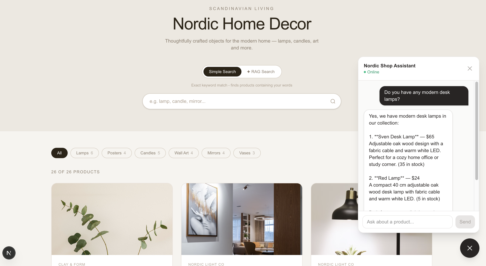
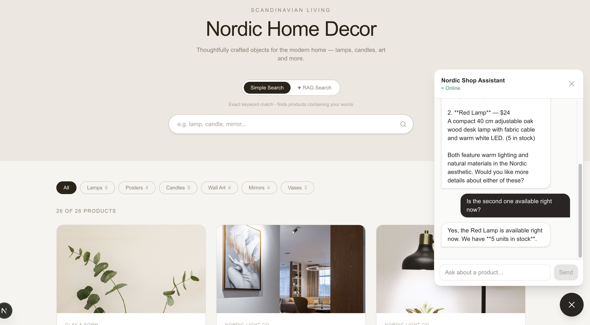

# Nordic Shop Agent — AI Shopping Assistant

An intelligent, AI-powered shopping assistant for the **Nordic Shop** home decor e-commerce platform. Built on an advanced agentic architecture using an optimized **Routing Workflow**, this assistant dynamically classifies intent, executes live database tools, and delivers clean, contextual responses directly to a Next.js web application.

---

## 🛠 Tech Stack

- **Backend & AI Runtime:** Python, FastAPI, Pydantic, Uvicorn, HTTPX
- **LLM Models:** `claude-haiku-4-5-20251001` (Main Assistant & Fast Router), `claude-sonnet-5` (Evaluation Grader / LLM-as-a-judge)
- **Tool Protocol:** Direct local function execution (Production) & Model Context Protocol (MCP via isolated standard input/output `stdio` subprocesses for behavioral evaluation)
- **Frontend:** Next.js (App Router), React, TypeScript, Tailwind CSS
- **Product Database:** PostgreSQL / Supabase backend

---

## ✨ Key Features

- 🎯 **Routing Workflow Infrastructure** — A dedicated, lightning-fast intent classifier filters out-of-scope requests before spinning up the heavy agent loop, significantly dropping token overhead and application latency.
- 🤖 **Autonomous Multi-Turn Agent** — Maintains stateful, multi-turn conversations and leverages real-time internal systems rather than relying on stale parametric memory.
- 🔌 **Parallel MCP Evaluation Track** — Product inventory and search functions were isolated inside a standard MCP server to evaluate decoupled agent architectures. **Successfully validated that wrapping tools in an MCP server preserves identical agent behavior, pushing the core evaluation score from 7.8 to 8.7/10 on both tracks.**
- 🧠 **Session-Based Management** — Chat state and contextual message sequences are bound seamlessly to isolated sessions on the backend using a unique `session_id`.
- 📊 **Automated System Prompt Evaluations** — Built-in offline testing pipelines using a robust evaluation harness to benchmark system-prompt performance.

## 📸 Screenshots

|                         Screen 1                         |                         Screen 2                         |
| :------------------------------------------------------: | :------------------------------------------------------: |
|  |  |

## 🏗️ System Architecture & Routing Workflow

The production pipeline utilizes a modular two-step processing pattern: **Categorization** and **Specialized Processing**.

```text
               [ Incoming User Prompt / Message ]
                                │
                                ▼
                       [ router.py (LLM) ]
                  (Cheap call: max_tokens=10)
                                │
               ┌────────────────┴────────────────┐
               ▼                                 ▼
       [ out_of_scope ]                   [ in_scope ]
               │                                 │
               ▼                                 ▼
     [ OUT_OF_SCOPE_REPLY ]           [ claude_client.py /chat ]
    (Immediate Static Return)      (Direct Local Function Tool Calling)
                                                 │
                                                 ▼
                                   [ Supabase / Product DB Route ]

─────────────────────────────────────────────────────────────────────────────────
[ PARALLEL EVALUATION HARNESS: VALIDATING MODEL CONTEXT PROTOCOL (MCP) PARITY ]

  User Input ──► [ router.py ] ──► [ mcp_agent.py CLI Loop ] ──► [ MCP Server ] ──► DB
```

---

## 🔧 Exposed Tools & Capabilities

When a request is routed as `in_scope`, the agent independently triggers the following core catalog capabilities:

- 🔍 `search_products(query)` — Searches the inventory catalog by keywords, product type, material, color, or style.
- 📦 `get_product(product_id)` — Fetches comprehensive technical specifications, dimensions, and source image configurations.
- 💡 `recommend_products(product_id)` — Generates item associations based on overlapping taxonomy.
- 📊 `check_availability(product_id)` — Triggers an immediate, live stock quantity lookup directly from the transactional database.

---

## 🌐 API Endpoint Schema (FastAPI)

### `POST /chat`

Submits a user message tied to a specific session state. It evaluates scope via the router first, then invokes Claude if needed.

**Request Payload:**

```json
{
  "session_id": "4a2b3c4d-5e6f-7a8b-9c0d-1e2f3a4b5c6d",
  "message": "I'm looking for an oak wood desk lamp"
}
```

**Response Payload:**

```json
{
  "reply": "We have the Sven Desk Lamp ($65) available, featuring adjustable oak wood arms. There are currently 35 units in stock."
}
```

---

## 🔐 Session Handling & Lifecycle Constraints

- **Current State:** Every message payload includes a `session_id`. The backend associates this ID with a temporary in-memory message list array.
- **Reload Limitation:** Reloading the web browser explicitly resets the active React state and triggers a fresh `crypto.randomUUID()`. Because this new token does not match any entry in the backend storage dictionary, a blank history array is initialized. This is an intentional constraint ideal for debugging clean system prompt iterations.
- **Production Plan:** For production deployments, the `session_id` can be cached directly inside browser `localStorage`, and the text thread dictionary can be migrated from active RAM to a permanent database collection.

---

## 📊 Core Concepts Demonstrated

- **Routing Workflows** — Isolating intent classification into a lightweight gatekeeper component to protect conversational resources.
- **Production-Grade AI Integration** — Embedding a state-of-the-art LLM into a realistic, sandboxed corporate infrastructure.
- **Architectural Parity Testing** — Proving that wrapping local production tools in an decoupled network environment (MCP) preserves exact functional parity (8.7/10 score match).
- **Data-Driven Evaluation Methodology** — Moving away from subjective manual workspace testing to systematic statistical prompt engineering with multi-trial grading.

---

## 🔭 Future Enhancements & Roadmap

- [ ] **Server-Sent Events (SSE) Streaming:** Introduce full token-by-token streaming to the Next.js frontend to minimize Time-to-Interact (TTI).
- [ ] **Persistent Database Layer:** Migrate active session lists out of volatile application RAM into persistent tables.
- [ ] **Batch Tool Operations:** Implement an optimized `availability_check_multiple` tool schema allowing Claude to track down several item inventories in a single context turn, reducing Anthropic API token overhead (TPM limits).
- [ ] **Advanced Failure Mode Dataset:** Expand the offline evaluation suite with intricate multi-turn negative test paths and edge cases.

---

## 🗂 Project Structure

```text
nordic-shop-agent/
├── router.py              ← Intent classifier (in_scope vs out_of_scope)
├── claude_client.py       ← High-level Anthropic SDK wrapper and direct tool routing (Production entrypoint)
├── main.py                ← Main asynchronous FastAPI service entry point (Port 8000)
├── tools.py               ← Low-level network endpoints parsing live application data
│
├── mcp_agent.py           ← Multi-turn agent CLI loop executing autonomous MCP tool chains
├── mcp_client.py          ← Core MCP client connection transport layer
├── mcp_server.py          ← Core MCP server establishing available tool schemas
│
├── dataset.json           ← Standard evaluation scenarios for offline testing
├── run_eval_mcp.py        ← Batch test loop processing data criteria trials
├── eval_grading.py        ← Strict rubric rules used by the grader judge model
└── README.md
```

_The frontend UI pages live inside the primary Next.js application directory:_

- `app/chat/page.tsx` — Interactive frontend user interface layout built with Tailwind CSS.
- `app/api/chat/route.ts` — Edge router acting as a secure local bridge between browser fetch loops and port 8000.
